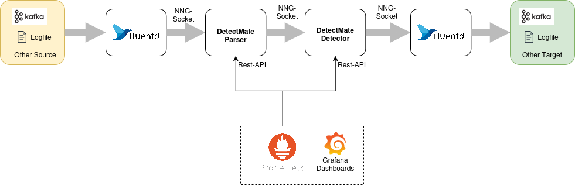

# Getting Started

DetectMate enables the creation of log analysis pipelines to analyze log data streams and detect violations or anomalies. It can be run from the console or embedded in Python programs as a library. Designed to operate analyses with limited resources and the lowest possible permissions, DetectMate is suitable for use on production servers. In practice, log analysis involves distinct steps that are central to its operation.

Logfile analysis consists of two main steps: first, parsing log lines, and second, detecting anomalies within those parsed lines. In modern systems, multiple applications process logs at various stages, creating a flow from raw log ingestion to final anomaly detection, and most likely even across different network nodes. This requires a highly configurable system to maintain the flexibility to create suitable log pipelines. DetectMate, therefore, uses a microservice architecture that allows connecting all components together as needed. 

The following diagram illustrates a typical log analysis pipeline:



Logfile ingestion is handled by Fluentd. It supports reading from various systems and can convert the data to a specific format before sending it to any other target. In our example, it reads lines from a file and sends them to the DetectMate parser. The parser processes the data and forwards them to the detector. If the detector finds an anomaly, it will send it to another Fluentd process that can communicate with various targets, such as Elasticsearch, Kafka, or a log file. To make configuring such a pipeline straightforward, the DetectmateService repository ships a boilerplate Docker Compose file. This tutorial will use the Docker Compose file so that we can focus on the anomaly detection only.

## The Objective

In this tutorial, we will set up a log data analysis pipeline that reads Nginx access logs. We will then train the detector on various paths in the HTTP requests. Finally, we will generate anomalies by sending HTTP requests to different paths of the trained model.

## Preparation

We will setup the DetectMate on a fresh installation of Ubuntu Noble:

```
alice@ubuntu2404:~$ lsb_release -a
No LSB modules are available.
Distributor ID:	Ubuntu
Description:	Ubuntu 24.04.4 LTS
Release:	24.04
Codename:	noble
```

In this tutorial we want to find anomalies in Nginx access.logs. So let's install nginx:

```
alice@ubuntu2404:~$ sudo apt update && sudo apt install nginx -y
Hit:1 http://at.archive.ubuntu.com/ubuntu noble InRelease
Hit:2 http://at.archive.ubuntu.com/ubuntu noble-updates InRelease
Hit:3 http://at.archive.ubuntu.com/ubuntu noble-backports InRelease
Hit:4 http://security.ubuntu.com/ubuntu noble-security InRelease
Reading package lists... Done
Building dependency tree... Done
Reading state information... Done
9 packages can be upgraded. Run 'apt list --upgradable' to see them.
Reading package lists... Done
Building dependency tree... Done
Reading state information... Done
The following additional packages will be installed:
  nginx-common
Suggested packages:
  fcgiwrap nginx-doc ssl-cert
The following NEW packages will be installed:
  nginx nginx-common
0 upgraded, 2 newly installed, 0 to remove and 9 not upgraded.
Need to get 565 kB of archives.
After this operation, 1,596 kB of additional disk space will be used.
Get:1 http://at.archive.ubuntu.com/ubuntu noble-updates/main amd64 nginx-common all 1.24.0-2ubuntu7.6 [43.5 kB]
Get:2 http://at.archive.ubuntu.com/ubuntu noble-updates/main amd64 nginx amd64 1.24.0-2ubuntu7.6 [521 kB]
Fetched 565 kB in 0s (2,816 kB/s)
Preconfiguring packages ...
Selecting previously unselected package nginx-common.
(Reading database ... 87543 files and directories currently installed.)
Preparing to unpack .../nginx-common_1.24.0-2ubuntu7.6_all.deb ...
Unpacking nginx-common (1.24.0-2ubuntu7.6) ...
Selecting previously unselected package nginx.
Preparing to unpack .../nginx_1.24.0-2ubuntu7.6_amd64.deb ...
Unpacking nginx (1.24.0-2ubuntu7.6) ...
Setting up nginx-common (1.24.0-2ubuntu7.6) ...
Created symlink /etc/systemd/system/multi-user.target.wants/nginx.service → /usr/lib/systemd/system/nginx.service.
Setting up nginx (1.24.0-2ubuntu7.6) ...
 * Upgrading binary nginx                                                                                                                                                                                                        [ OK ]
Processing triggers for man-db (2.12.0-4build2) ...
Processing triggers for ufw (0.36.2-6) ...
Scanning processes...
Scanning linux images...

Running kernel seems to be up-to-date.

No services need to be restarted.

No containers need to be restarted.

No user sessions are running outdated binaries.

No VM guests are running outdated hypervisor (qemu) binaries on this host.

alice@ubuntu2404:~$
```

We can try to send HTTP-requests to our local Nginx:

```
alice@ubuntu2404:~$ curl http://localhost
<!DOCTYPE html>
<html>
<head>
<title>Welcome to nginx!</title>
<style>
html { color-scheme: light dark; }
body { width: 35em; margin: 0 auto;
font-family: Tahoma, Verdana, Arial, sans-serif; }
</style>
</head>
<body>
<h1>Welcome to nginx!</h1>
<p>If you see this page, the nginx web server is successfully installed and
working. Further configuration is required.</p>

<p>For online documentation and support please refer to
<a href="http://nginx.org/">nginx.org</a>.<br/>
Commercial support is available at
<a href="http://nginx.com/">nginx.com</a>.</p>

<p><em>Thank you for using nginx.</em></p>
</body>
</html>
alice@ubuntu2404:~$
```

Now we should have at least one line in /var/log/nginx/access.log:

```
alice@ubuntu2404:~$ sudo cat /var/log/nginx/access.log
::1 - - [18/Mar/2026:11:43:30 +0000] "GET / HTTP/1.1" 200 615 "-" "curl/8.5.0"
```

Since we have a working webserver, we can now move on to deploy the logdata anomaly pipeline.

## Deploying the Pipeline

We need Docker and Docker Compose for the deployment. A comprehensive tutorial about how to install Docker can be found at https://docs.docker.com/engine/install/ubuntu/

In this section, we will focus solely on the installation commands.

First run the following command to uninstall all conflicting packages:

```
sudo apt remove $(dpkg --get-selections docker.io docker-compose docker-compose-v2 docker-doc podman-docker containerd runc | cut -f1)
```

Now set up Docker's apt repository:

```
# Add Docker's official GPG key:
sudo apt update
sudo apt install ca-certificates curl
sudo install -m 0755 -d /etc/apt/keyrings
sudo curl -fsSL https://download.docker.com/linux/ubuntu/gpg -o /etc/apt/keyrings/docker.asc
sudo chmod a+r /etc/apt/keyrings/docker.asc

# Add the repository to Apt sources:
sudo tee /etc/apt/sources.list.d/docker.sources <<EOF
Types: deb
URIs: https://download.docker.com/linux/ubuntu
Suites: $(. /etc/os-release && echo "${UBUNTU_CODENAME:-$VERSION_CODENAME}")
Components: stable
Signed-By: /etc/apt/keyrings/docker.asc
EOF

sudo apt update
```

Install docker and docker compose:

```
sudo apt install docker-ce docker-ce-cli containerd.io docker-buildx-plugin docker-compose-plugin
```

!!! note
    Since we did not add our user to the docker group, we have to use sudo for docker compose!

With Docker compose working, we will now download the DetectmateService repository using `git`:

```
alice@ubuntu2404:~$ git clone https://github.com/ait-detectmate/DetectMateService.git
Cloning into 'DetectMateService'...
remote: Enumerating objects: 2303, done.
remote: Counting objects: 100% (372/372), done.
remote: Compressing objects: 100% (227/227), done.
remote: Total 2303 (delta 171), reused 171 (delta 131), pack-reused 1931 (from 3)
Receiving objects: 100% (2303/2303), 3.97 MiB | 9.12 MiB/s, done.
Resolving deltas: 100% (1229/1229), done.
alice@ubuntu2404:~$ cd DetectMateService/
```


Let's start the default pipeline, just to test it:

```
alice@ubuntu2404:~/DetectMateService$ sudo docker compose up -d
[+] up 6/6
 ✔ Container detectmateservice-fluentout-1 Started                                                                                                                                                                                 
 ✔ Container prometheus                    Started                                                                                                                                                                                 s
 ✔ Container grafana                       Started                                                                                                                                                                                 s
 ✔ Container detectmateservice-detector-1  Started                                                                                                                                                                                 s
 ✔ Container detectmateservice-parser-1    Started                                                                                                                                                                                  
 ✔ Container detectmateservice-fluentin-1  Started                                                                                                                                                                                  
alice@ubuntu2404:~/DetectMateService$
```

To check the status of the containers, we can use `docker compose ps`:

```
alice@ubuntu2404:~/DetectMateService$ sudo docker compose ps
NAME                            IMAGE                         COMMAND                  SERVICE      CREATED         STATUS         PORTS
detectmateservice-detector-1    detectmateservice-detector    "uv run detectmate -…"   detector     4 minutes ago   Up 3 minutes   0.0.0.0:8002->8000/tcp, [::]:8002->8000/tcp
detectmateservice-fluentin-1    detectmateservice-fluentin    "tini -- /bin/entryp…"   fluentin     4 minutes ago   Up 3 minutes   5140/tcp, 24224/tcp
detectmateservice-fluentout-1   detectmateservice-fluentout   "tini -- /bin/entryp…"   fluentout    4 minutes ago   Up 3 minutes   5140/tcp, 24224/tcp
detectmateservice-parser-1      detectmateservice-parser      "uv run detectmate -…"   parser       4 minutes ago   Up 3 minutes   0.0.0.0:8001->8000/tcp, [::]:8001->8000/tcp
grafana                         grafana/grafana:latest        "/run.sh"                grafana      4 minutes ago   Up 3 minutes   0.0.0.0:3000->3000/tcp, [::]:3000->3000/tcp
prometheus                      prom/prometheus:latest        "/bin/prometheus --c…"   prometheus   4 minutes ago   Up 3 minutes   9090/tcp
```


For now, we will shutdown all containers:

```
alice@ubuntu2404:~/DetectMateService$ sudo docker compose down -v
[+] down 9/9
 ✔ Container grafana                        Removed                                                                                                                                                                              
 ✔ Container detectmateservice-fluentin-1   Removed                                                                                                                                                                               
 ✔ Container prometheus                     Removed                                                                                                                                                                               
 ✔ Container detectmateservice-parser-1     Removed                                                                                                                                                                               
 ✔ Container detectmateservice-detector-1   Removed                                                                                                                                                                               
 ✔ Container detectmateservice-fluentout-1  Removed                                                                                                                                                                              
 ✔ Volume detectmateservice_grafana_data    Removed                                                                                                                                                                               
 ✔ Network detectmateservice_default        Removed                                                                                                                                                                               
 ✔ Volume detectmateservice_prometheus_data Removed
```

We have finally all requirements installed and have a boilerplate template for docker compose that starts an initial pipeline. In the next sections we will reconfigure that 
pipeline so that we can read the access.log and generate anomalies.

## Mount the access.log

The preconfigured pipeline reads logs from `container/fluentlogs/some.log`. In order to be able to read the nginx access.log file, we need to mount /var/log/nginx into the fluentin container
and modify the fluentd config so that it reads access.log instead.

Initially we edit the docker-compose.yml and change only the line 11 to use `/var/log/nginx`:

```
# version: "3"

services:
    fluentin:
      #image: dm-fluentd:latest
      build:
        context: .
        dockerfile: container/Dockerfile_fluentd
      volumes:
        - '$PWD/container/fluentin:/fluentd/etc'
        - '/var/log/nginx:/fluentd/log'
        - '$PWD/container/run:/run'
      depends_on:
        - parser

    parser:
      # image: detectmate:dev-0.1.6
      build: .
      volumes:
        - '$PWD/container/config:/config'
        - '$PWD/container/logs:/logs'
        - '$PWD/container/run:/run'
      command: uv run detectmate --settings /config/parser_settings.yaml --config /config/parser_config.yaml
      ports:
        - "8001:8000"
      depends_on:
        - detector

    detector:
      # image: detectmate:dev-0.1.6
      build: .
      volumes:
        - '$PWD/container/config:/config'
        - '$PWD/container/logs:/logs'
        - '$PWD/container/run:/run'
      command: uv run detectmate --settings /config/detector_settings.yaml --config /config/detector_config.yaml
      ports:
        - "8002:8000"
      depends_on:
        - fluentout

    fluentout:
      # image: dm-fluentd:latest
      build:
        context: .
        dockerfile: container/Dockerfile_fluentd
      volumes:
        - '$PWD/container/fluentout:/fluentd/etc'
        - '$PWD/container/fluentlogs:/fluentd/log'
        - '$PWD/container/run:/run'

    prometheus:
      image: prom/prometheus:latest
      container_name: prometheus
      restart: unless-stopped
      volumes:
        - ./container/prometheus.yml:/etc/prometheus/prometheus.yml
        - prometheus_data:/prometheus
      command:
        - '--config.file=/etc/prometheus/prometheus.yml'
        - '--storage.tsdb.path=/prometheus'
        - '--web.console.libraries=/etc/prometheus/console_libraries'
        - '--web.console.templates=/etc/prometheus/consoles'
        - '--web.enable-lifecycle'
      expose:
        - 9090

    grafana:
      image: grafana/grafana:latest
      container_name: grafana
      ports:
        - "3000:3000"
      environment:
        - GF_SECURITY_ADMIN_PASSWORD=admin
      depends_on:
        - prometheus
      volumes:
        - ./container/grafana/prometheus.yml:/etc/grafana/provisioning/datasources/prometheus.yml
        - grafana_data:/var/lib/grafana

          #    kafka:
          #      image: apache/kafka-native
          #      ports:
          #        - "9092:9092"
          #      environment:
          #        KAFKA_LISTENERS: CONTROLLER://localhost:9091,HOST://0.0.0.0:9092,DOCKER://0.0.0.0:9093
          #        KAFKA_ADVERTISED_LISTENERS: DOCKER://kafka:9093,HOST://kafka:9092
          #        KAFKA_LISTENER_SECURITY_PROTOCOL_MAP: CONTROLLER:PLAINTEXT,DOCKER:PLAINTEXT,HOST:PLAINTEXT
          #
          #        # Settings required for KRaft mode
          #        KAFKA_NODE_ID: 1
          #        KAFKA_PROCESS_ROLES: broker,controller
          #        KAFKA_CONTROLLER_LISTENER_NAMES: CONTROLLER
          #        KAFKA_CONTROLLER_QUORUM_VOTERS: 1@localhost:9091
          #
          #        # Listener to use for broker-to-broker communication
          #        KAFKA_INTER_BROKER_LISTENER_NAME: DOCKER
          #
          #        # Required for a single node cluster
          #        KAFKA_OFFSETS_TOPIC_REPLICATION_FACTOR: 1

volumes:
  prometheus_data:
    driver: local
  grafana_data:
    driver: local
```

Now that the access.logs are available in the container, we have to point fluentd to read that file. We need to edit the file `container/fluentin/fluent.conf` and replace `path /fluentd/log/some.log` with `path /fluentd/log/access.log`:

```
<source>
  @type tail
  @id input_tail
  <parse>
    @type none
  </parse>
  path /fluentd/log/access.log
  path_key logSource

  tag nng.*
</source>

<match nng.**>
  @type nng
  uri ipc:///run/parser.engine.ipc
  <inject>
    hostname_key hostname
    # overwrite hostname:
    # hostname somehost
  </inject>
  <buffer>
    flush_mode immediate
  </buffer>
  <format>
    @type detectmate
  </format>
</match>
```

The Nginx access.log will be mounted into the `fluentin` container and fluentd is using the correct file. We can finally look into the DetectMate config and
generate anomalies.

## DetectMate Config

The log pipeline uses two DetectMate services, parser and detector. The parser splits the log line into meaningful tokens, which the detector then uses to identify anomalies. We need to configure the parser and detector. Since detector needs to know which tokens it receives from the parser so it can look for anomalies, the two configurations are closely related.

### Parser

The Nginx log line we previously created has a very specific format:

```
::1 - - [18/Mar/2026:11:43:30 +0000] "GET / HTTP/1.1" 200 615 "-" "curl/8.5.0"
```

This format can be described like that:

```
<IP> - - [<Time>] "<Method> <URL> <Protocol>" <Status> <Bytes> "<Referer>" "<UserAgent>"
```

DetectMate includes a matcher_parser that can split such a log line. The configuration for
the parser is in `container/config/parser_config.yaml`:

```
parsers:
  MatcherParser:
    method_type: matcher_parser
    auto_config: false
    log_format: '<IP> - - [<Time>] "<Method> <URL> <Protocol>" <Status> <Bytes> "<Referer>" "<UserAgent>"'
    time_format: null
    params:
      remove_spaces: false
      remove_punctuation: false
      lowercase: false
      path_templates: /config/templates.txt  # empty file because there are no templates necessary for apache access logs
```

We don't need to modify that configuration, since it is compatible with the nginx access.log format and we can now continue with the configuration of the detector.

### Detector

The simplest way to generate anomalies is to watch a single field of the parsed data and learn all its values during training. As soon as the detector switches from training mode to detection mode, all values not found in the trained model are flagged as anomalies. DetectMate ships with a `new_value_detector` that can do exactly that. The config `container/config/detector_config.yaml` looks as follows:

```
detectors:
  NewValueDetector:
   method_type: new_value_detector
   data_use_training: 2
   auto_config: false
   global:  # define global instance for new_value_detector similar to "events"
     global_instance:  # define instance name
       header_variables:  # another level to have the same structure as "events"
         - pos: URL
```

Here, the `URL` token from the parsed data is monitored (`- pos: URL`), and the first two log lines are used for training (`data_use_training: 2`). Any subsequent log lines will be evaluated for anomalies and compared against the values seen during training on the first two log lines.

Now let's start the pipeline using `sudo docker compose up -d` and send two valid log lines with two different status values:

```
alice@ubuntu2404:~/DetectMateService$ sudo docker compose up -d
[+] up 7/7
 ✔ Network detectmateservice_default       Created                                                                                                                                                                      
 ✔ Container prometheus                    Started                                                                                                                                                                        
 ✔ Container detectmateservice-fluentout-1 Started                                                                                                                                                                          
 ✔ Container detectmateservice-detector-1  Started                                                                                                                                                                            
 ✔ Container grafana                       Started                                                                                                                                                                              
 ✔ Container detectmateservice-parser-1    Started                                                                                                                                                                                  
 ✔ Container detectmateservice-fluentin-1  Started                                                              
alice@ubuntu2404:~/DetectMateService$ sudo docker compose ps
NAME                            IMAGE                         COMMAND                  SERVICE      CREATED         STATUS         PORTS
detectmateservice-detector-1    detectmateservice-detector    "uv run detectmate -…"   detector     7 seconds ago   Up 5 seconds   0.0.0.0:8002->8000/tcp, [::]:8002->8000/tcp
detectmateservice-fluentin-1    detectmateservice-fluentin    "tini -- /bin/entryp…"   fluentin     7 seconds ago   Up 4 seconds   5140/tcp, 24224/tcp
detectmateservice-fluentout-1   detectmateservice-fluentout   "tini -- /bin/entryp…"   fluentout    8 seconds ago   Up 6 seconds   5140/tcp, 24224/tcp
detectmateservice-parser-1      detectmateservice-parser      "uv run detectmate -…"   parser       7 seconds ago   Up 5 seconds   0.0.0.0:8001->8000/tcp, [::]:8001->8000/tcp
grafana                         grafana/grafana:latest        "/run.sh"                grafana      7 seconds ago   Up 5 seconds   0.0.0.0:3000->3000/tcp, [::]:3000->3000/tcp
prometheus                      prom/prometheus:latest        "/bin/prometheus --c…"   prometheus   8 seconds ago   Up 6 seconds   9090/tcp
alice@ubuntu2404:~/DetectMateService$
```

Wait a couple of minutes until parser and detector containers are up and running. You can check by executing `sudo docker compose logs parser` or `sudo docker compose logs detector`.
The output of the component should show `Uvicorn running on` or any HTTP-requests for the /metrics endpoint:

```
parser-1  | [2026-03-18 15:21:45,017] INFO detectmatelibrary.parsers.json_parser.MatcherParser.b7ce95e085705d4d87b71db2d1392f08: setup_io: ready to process messages
parser-1  | [2026-03-18 15:21:45,017] INFO detectmatelibrary.parsers.json_parser.MatcherParser.b7ce95e085705d4d87b71db2d1392f08: HTTP Admin active at 0.0.0.0:8000
parser-1  | [2026-03-18 15:21:45,018] INFO detectmatelibrary.parsers.json_parser.MatcherParser.b7ce95e085705d4d87b71db2d1392f08: Auto-starting engine...
parser-1  | [2026-03-18 15:21:45,018] INFO detectmatelibrary.parsers.json_parser.MatcherParser.b7ce95e085705d4d87b71db2d1392f08: engine started
parser-1  | INFO:     Started server process [61]
parser-1  | INFO:     Waiting for application startup.
parser-1  | INFO:     Application startup complete.
parser-1  | INFO:     Uvicorn running on http://0.0.0.0:8000 (Press CTRL+C to quit)
parser-1  | INFO:     172.18.0.2:43378 - "GET /metrics HTTP/1.1" 200 OK
parser-1  | INFO:     172.18.0.2:39840 - "GET /metrics HTTP/1.1" 200 OK
```

Now generate two access.log lines:

```
alice@ubuntu2404:~/DetectMateService$ curl http://localhost/hello
<html>
<head><title>404 Not Found</title></head>
<body>
<center><h1>404 Not Found</h1></center>
<hr><center>nginx/1.24.0 (Ubuntu)</center>
</body>
</html>
alice@ubuntu2404:~/DetectMateService$ curl http://localhost/world
<html>
<head><title>404 Not Found</title></head>
<body>
<center><h1>404 Not Found</h1></center>
<hr><center>nginx/1.24.0 (Ubuntu)</center>
</body>
</html>
alice@ubuntu2404:~/DetectMateService$
```

We now trained with the two values `hello` and `world`. This means, as soon as we query any other url than `/hello` or `/world` we should receive an anomaly. Anomalies get logged in `container/fluentlogs/output.%Y%m%d`. With `cat container/fluentlogs/output.%Y%m%d` find the filename `buffer.<id>.log` and have a look:

```
alice@ubuntu2404:~/DetectMateService$ curl http://localhost/foobar
<html>
<head><title>404 Not Found</title></head>
<body>
<center><h1>404 Not Found</h1></center>
<hr><center>nginx/1.24.0 (Ubuntu)</center>
</body>
</html>
alice@ubuntu2404:~/DetectMateService$ sudo cat container/fluentlogs/output.%Y%m%d/buffer.q64d4e42c345866e56bc160786171b408.log
2026-03-18T15:39:43+00:00	nng.input	{"__version__":"1.0.0","detectorID":"NewValueDetector","detectorType":"new_value_detector","alertID":"10","detectionTimestamp":1773848383,"logIDs":["e5d922c8-19e1-47d1-842b-7bbabecb384d"],"score":1.0,"extractedTimestamps":[1773848383],"description":"NewValueDetector detects values not encountered in training as anomalies.","receivedTimestamp":1773848383,"alertsObtain":{"Global - URL":"Unknown value: '/foobar'"}}
alice@ubuntu2404:~/DetectMateService$
```

Great! We detected our first anomaly.

This was a very basic example, but it shows how to easily deploy a full log data anomaly pipeline, including two DetectMate services, using a parser for the Nginx access log format, and how this is then used to flag an anomaly. 
