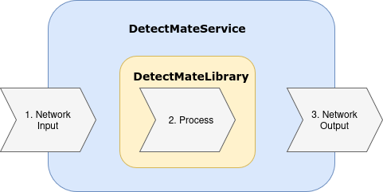

# DetectMate Service Framework

Welcome to the DetectMate Service Framework documentation. DetectMate is a flexible, component-based framework for
building distributed detection and processing services.

The Detectmate Framework consists of the [Detectmate Service](https://github.com/ait-detectmate/DetectMateService) and the [Detectmate Library](https://github.com/ait-detectmate/DetectMateLibrary). The DetectMate Service is a very generic Microservice that handles the input, forwards it to the DetectMate Library, which processes the data, and finally sends the results back to the output interfaces.

It uses NNG's messaging architecture to process data in real-time.

## Key features

- **Modular design**: easily extensible with custom processors and components.
- **Resilient networking**: built on top of [`pynng`](https://pynng.readthedocs.io/en/latest/) (NNG) for high-performance messaging.
- **Configurable**: fully configurable via YAML files or environment variables.
- **Service management**: built-in CLI for starting, stopping, and monitoring the service.
- **Scalable**: run multiple independent service instances.

## Where to start

The documentation has two different entry points: the **tutorial**, which builds a complete example log analysis
pipeline from Docker containers so you can see the whole system work, and the **user guide**,
which walks you through installing and configuring a single DetectMate service of your own.
Pick the one that matches what you want to do.

### Run the tutorial

**[Tutorial: Detecting Anomalies in Nginx Logs](tutorial.md)** is the recommended starting point if
you are new to DetectMate. It is a *guided walkthrough* that takes you from a fresh Ubuntu machine to a
complete log analysis pipeline: Nginx produces access logs, Fluentd ingests them, a
DetectMate parser structures them, detectors flag anomalies, and the results are displayed in
Grafana. By the end you will have triggered real anomalies yourself and seen them come out the other side.

It assumes no prior knowledge of DetectMate and takes roughly an hour.

### User guide: Set up your own service

The user guide is the *conventional, reference documentation*:
If you are past the tutorial, or want to run a single DetectMate service instead
of a whole pipeline, read these in order:

1. [Installation](installation.md): install the service and its optional extras.
2. [Configuration](configuration.md) : service settings and component configuration files.
3. [Usage](usage.md): the `detectmate` CLI: starting, stopping, and inspecting a service.
4. [Using a Library Component](library.md): run a detector or parser from DetectMateLibrary.
5. [Monitoring with Prometheus](prometheus.md): metrics and scrape configuration.

### Reference and development

- [Docker Compose reference](docker-compose.md): every service in the shipped Compose file, and how
  they are connected. The reference companion to the tutorial.
- [Library Imports](library-imports.md): which parts of DetectMateLibrary the service uses, and why.
- [Library Interface Contract](interfaces.md): for library developers implementing custom components.

## Contribution

We're happily taking patches and other contributions. Please see the following links for how to get started:

- [Git Workflow](contribution.md)
- [Development Details](development.md)

## License

DetectMateService is Free Open Source Software and uses the [EUPL-1.2 License](https://github.com/ait-detectmate/DetectMateService/blob/main/LICENSE.md)
